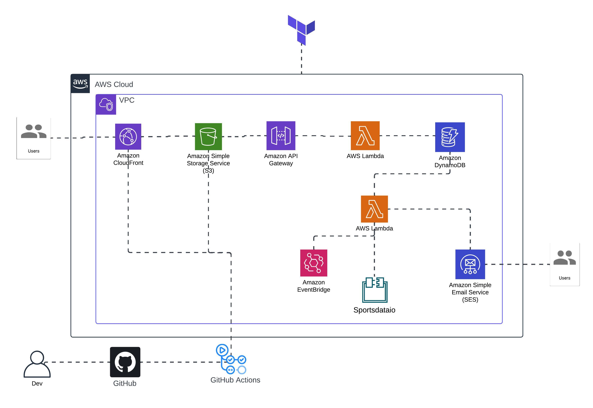

# NBA Gameday Notification
The NBA Gameday Notification Service is an event-driven service designed to fetch real-time NBA gameday fixtures and final scores using the SportdataIO API. It utilizes **AWS Lambda and python, Amazon SNS, Amazon EventBridge** for the AWS stack to process and notify users about game details via email and SMS. The infrastructure is provisioned using **Terraform** for Infrastructure as Code (IaC).

## Features
- **Real-time NBA Data:** Fetches live game fixtures and scores from the Sportsdata.io API.
- **Event-driven Architecture:** Built using AWS services to ensure seamless data collection and notification dispatch.
- **Multi-channel Notifications:** Sends updates via email and SMS using Amazon SNS.
- **Serverless:** Fully serverless implementation using AWS Lambda for executing tasks.
- **Infrastructure as Code:** All AWS resources are provisioned using Terraform for consistency and scalability.

## Technologies Used
- **Programming Language:** Python
- **Infrastructure as Code:** Terraform
- **API:** SportdataIO
- **Cloud Provider:** AWS
    - **Services:** Lambda, SNS, EventBridge

## Project Structure
```markdown
    nba-gameday-notification/ 
    ├── .github/workflows
    │   └── frontend_ci_cd.yaml        # CI/CD for frontend
    │ 
    ├──frontend/                       # files for Web UI
    │   ├── index.html
    │   ├── index.js
    │   └── style.css
    │ 
    ├── infrastructure/                 
    │   ├── modules/     
    │   ├── main.tf                     # AWS infrastructure definition
    │   ├── provider.tf                 # AWS config for terraform
    |   └── variables.tf                # Input variables for terraform
    |  
    ├── src/  
    │   ├── gd_notification.py          # Lambda function code
    │   └──  gd_notification.zip          
    |
    ├── .gitignore                      # Ignored files   
    └── README.md                       # Project documentation 
```
## Architecture 


## Getting Started
Prerequisites
- AWS Account
- Terraform Installed
- [Sportdata.io](https://sportsdata.io/) API Key

## Steps

1. Clone the Repository:
```bash
    git clone https://github.com/oyogbeche/nba_gameday_notification.git
    cd nba_gameday_notification
```
2. Configure Terraform
    - Create `.tfvars` file to configure the terraform variables for the infrastructure
    - check the modules for variable descriptions
    - configure aws profile in `provider.tf`

3. Deploy Infrastructure with Terraform
```bash
    terraform init
    terraform plan
    terraform apply
```
## What I Learned 
- Using terraform modules and optimizing for reusability
- Setting up serverless Event driven architecture 
- Security best practice with least priviledge access
- Integrating external APIs into cloud-based workflows.
